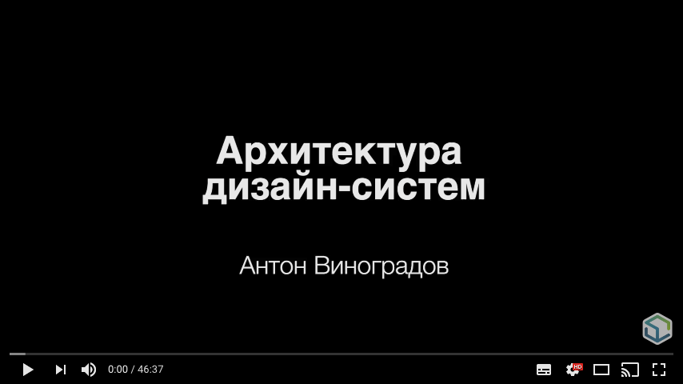
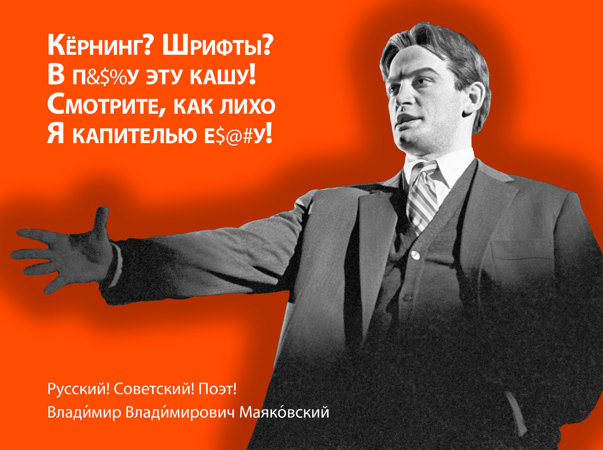
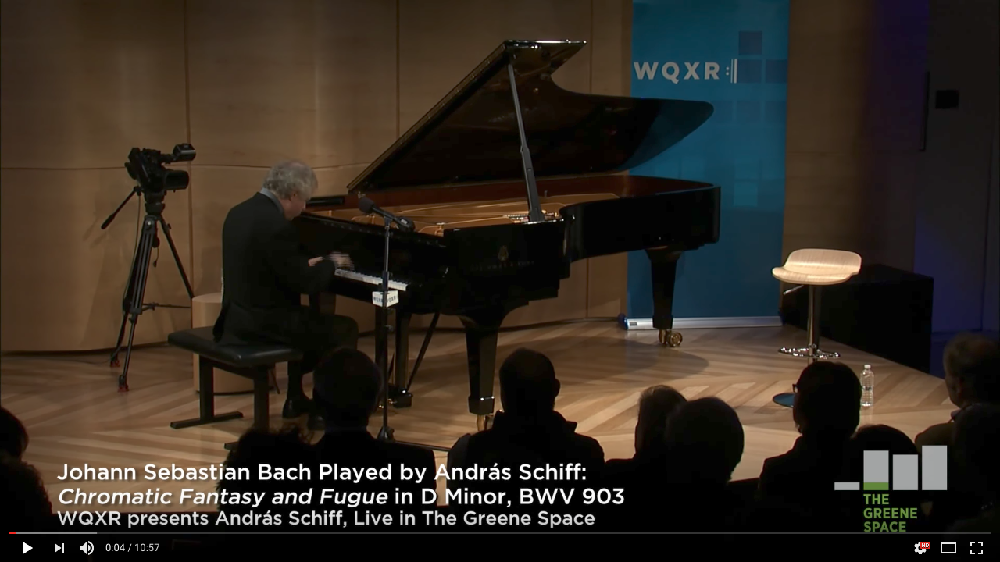
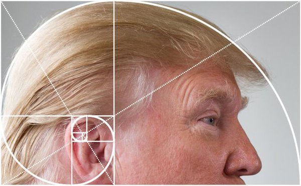

«Дизайн-система. Типографика»
=====================================

На дворе 2018 год, паровоз фронтенда беспощадно несётся: ECMAScript-модули, WebAssembly, Service Workers, WebVR, PWA. Не столь важно, какие инструменты мы используем, мы создаём интерфейсы, помогающие нашим пользователям решать свои задачи. От того, что мы делаем, многое зависит.

«Подвигать пиксели…» не от слова __подвиг__. У нас появились новые инструменты для дизайна и прототипирования, мы накопили огромный опыт и практики, результаты метрик и исследований. Неправильные решения в инструментах, которые мы используем, вынуждают нас следовать той же идеологии, но давайте разберёмся, откуда «растут ноги» у типичных интерфейсов. Поверьте, всё не так плохо… Пора разорвать порочный круг.


О себе
---------------------------------------------------------------------------------------------------

- MODX Ambassador в России;
- руководитель санкт-петербургского клуба разработчиков MODX;
- активный участник и докладчик сообществ:
  - SPB Frontend — [о типографике в вебе](https://vk.com/spb_frontend_meetup_130416),
  - Веб-стандартов — о теге `<head>` [в Питере](https://wsd.events/2016/10/01/) и [Киеве](https://wsd.events/2016/11/26/),
  - PiterCSS — «[приквел][PiterCSS6]» к данному докладу (PiterCSS № 6);
- люблю типографику, интерфейсы и UI/UX;


О докладе
---------------------------------------------------------------------------------------------------

- вдохновлён презентацией Антона Виноградова «[Архитектура дизайн-систем][PiterCSS2]» (PiterCSS № 2);
- идея доклада родилась в процессе создания «с нуля» полноценной дизайн-системы;
- для дизайнеров, работающих с интерфейсами, и верстальщиков, знакомых с базовыми принципами вёрстки.

| [][PiterCSS2] |
|:-:|
| Антон Виноградов, «Архитектура дизайн-систем» (PiterCSS № 2) |

 
> «Инлайновый контекст форматирования»<br>
> — Максим Усачёв aka <a href="https://twitter.com/psyw" target="_blank">psywalker</a> и Илья Стрельцын aka <a href="http://twitter.com/SelenIT2" target="_blank">SelenIT</a><br>
> http://bit.ly/inline-context


Критерии идеального компонента
---------------------------------------------------------------------------------------------------

работают с контентом (текстом):

- на любом языке (интернационализация),
- с любым количеством (адаптивность),
- при максимальном количестве условий (доступность). 


О дизайне
---------------------------------------------------------------------------------------------------

Дизайн можно «измерить» двумя характеристиками:

- эмоциональный — лендинги, слайдеры, флаеры, постеры…;
- информационный — __типографика__, __интерфейсы__.

Но это не «две стороны одной медали», они всегда существуют неразрывно. Можно злоупотребить с эмоциональностью и интерфейс будет менее информативным, и наоборот — излишняя информативность (например, в таблицах) усложняет восприятие.


Так ли важен текст?
---------------------------------------------------------------------------------------------------

Представим себе интерфейс, который лишен главного условия информативности, т. е. текста.


Параметры текста
---------------------------------------------------------------------------------------------------

- цвет (`color`);
- размер (`font-size`);
- межстрочный интервал (_интерлиньяж_ для дизайнеров, `line-height` — у верстальщиков) 

### Вертикальный ритм

Типографский приём, управление вертикальными отступами, основыванное на расстоянии, кратном межстрочному интервалу.


Параграф
---------------------------------------------------------------------------------------------------

<blockquote>
  <p>О том, что такое «прекрасно свёрстанный абзац», есть информация в разных справочниках, вкратце можно было бы просуммировать следующим списком:</p>
  <ol>
    <li>правильный шрифт;
    <li>межбуквенные расстояния в каждой строке изменяются в разумных пределах;
    <li>межсловные пробелы в каждой строке в разумных пределах;
    <li>межсловные пробелы в соседних строках не слишком сильно отличаются;
    <li>разумный интерлиньяж;
    <li>гармоничный абзацный отступ или буквица;
    <li>аккуратный левый край (оптически), без одинаково начинающихся соседних строк (homeoarchy);
    <li>аккуратный правый край (оптически), без частокола многих переносов кряду и без одинаково заканчивающихся соседних строк (homoioteleuton);
    <li>если набор «флагом» (align=left) или выключкой по центру (align=center), то слово в конце строки не должно «висеть в воздухе», оно должно опираться на буквы следующей строки;
    <li>хорошая последняя строка: не слишком короткая (меньше 2 длин абзацных отступов) и не выглядящая недотянутой (до правого края остаётся меньше, чем абзацный отступ);
    <li>без «коридоров» (rivers of white);
    <li>без неблагозвучных переносов или незапланированных ассоциаций.
  </ol>
  <footer>— Пантелеимон a.k.a. @pantlmn, <a href="https://habr.ru/p/339110/">В абзаце всё должно быть прекрасно</a></footer>
</blockquote>

### Статьи

[Typography is impossible](https://medium.engineering/typography-is-impossible-5872b0c7f891), Marcin Wichary, [перевод](http://prgssr.ru/development/nevozmozhnaya-tipografika.html)


Заголовок
---------------------------------------------------------------------------------------------------

> 💁: «Главное — не размер», — скажут опытные верстальщицы.<br>
> 🙇: «А умение им пользоваться!», — поддержат их робкие верстальщики.

Заголовки характеризуются теми же параметрами, что и основной текст, но бо́льшего размера, т. е. для получения нового компонента нам достаточно изменить всего один из основных параметров. Опционально мы может изменить жирность — это не нарушит вертикальный ритм.

### Капитель

|  |
|:-:|
| Влади́мир Влади́мирович Маяко́вский — русский! Советский! Поэт! |

Начертание в гарнитуре, в которой строчные знаки выглядят как уменьшенные заглавные. Чтобы подчеркнуть разницу между капителью и строчными буквами, её делают немного выше строчных, а полуапроши капительных знаков увеличивают.

### Ссылки по теме

[Типографика заголовков](http://ddd.exmachina.ru/paper/headers/), Влад В. Головач

- - -

Как изменить размер, чтобы это было контролируемо и эстетически гармонично (без регистрации и смс)?

### Математические закономерности в музыке.

| <a href="https://youtu.be/SNWOhm5iXxs"></a> |
|:-:|
| Хроматическая фантазия и фуга И. С. Баха в исполнении Андраса Шиффа |

<!--
<iframe src="https://open.spotify.com/embed/track/0YAS8SxEvJGbrzw2r3kNuI" width="300" height="80" frameborder="0" allowtransparency="true"></iframe>
-->

Хроматическая фантазия и фуга И. С. Баха объединены общей тональностью _ре минор_ и контрастны по жанру и образу. Хроматическая фантазия с фугой _ре минор_ — одно из величайших творений Баха, образец совершенства формы и содержания, «могущественнейшее клавесинное произведение».

Хроматическая фантазия написана в размере 4/4, имеет 79 тактов, т. е. 79 × 4 = 316 четвертных долей.

Фантазия состоит из двух ясно различимых по характеру частей, отделенных друг от друга паузой. Первая часть, прелюдия, заканчивается на на 3-й четверти 49-го такта, т. е. на 195-й (48 × 4 + 3) четверти a<sub>1</sub> = 195. На вторую часть приходится 121 четверть (a<sub>2</sub> = a - a<sub>1</sub> = 316 - 195 = 121).

Вычисляя отношение длин обеих частей, мы находим:

```
121 ÷ 195 ≈ 0,6
```

Итак, Хроматическая фантазия разделена на первую и вторую части в золотой пропорции:

```
316   195
--- = ---, 195 + 121 = 316
195   121
```

Но это только верхушка айсберга: http://www.wikiznanie.ru/wikipedia/index.php/Золотое_сечение_(в_музыке)

### Модульная шкала

Модульная шкала – последовательность чисел, относящихся друг к другу определённым образом, т. е. увеличение шрифта строится на известном множителе:

- «золотое сечение» — 1:1,618;
- последовательность Фибоначчи: 0, 1, 1, 2, 3, 5, 8, 13, 21, 34, 55, …;
- музыкальные интервалы: квартдецимы, септимы, терции и т. д.



#### Инструменты:

- [modularscale.com](http://www.modularscale.com/);
- [type-scale.com](http://type-scale.com/);
- [archetypeapp.com](http://archetypeapp.com/).

#### Ссылки по теме:

- [Модульная шкала и осмысленная типографика](http://marknelyubin.ru/modularscale/), Марк Нелюбин


### CSS-шлюзы (CSS locks)

Характерный исключительно для «экранного» мира приём плавного масштабирования текста (не только), основанный на ширине области просмотра, а не на точках медиа запросов.

|  |
|:-:|
| При ширине меньше 320 пикселей будем использовать шрифты 20px, свыше 960 пикселей — 40px, а между 320 и 960 — от 20px до 40px |

#### Примеры

```
h1 {
  font-size: 1.5rem;
  /* Increment: (1.3333 - 1.2) × 24px = 3.2px */
  line-height: calc( 1.2em + 3.2px );
}
p {
  font-size: .9375rem;
  line-height: 1.5em;
}
@media (min-width: 320px) {
  h1 {
    font-size: calc( 1.5rem + 2.5vw - 8px );
    /* from 120% + 3.2px to 120% + 0px */
    line-height: calc( 1.2em - .5vw + 4.8px )
  }
  p {
    font-size: calc( .9375rem + .46875vw - 1.5px );
    /* from 150% + 0px to 150% + 4.5px */
    line-height: calc( 1.5em + .7031vw - 2.25px );
  }
}
@media (min-width: 960px) {
  h1 {
    font-size: calc(1.5rem + 16px);
    /* Base value, no increment needed. */
    line-height: 1.2em;
  }
  p {
    font-size: calc( .9375rem + 3px );
    /* Increment: (1.75 - 1.5) × 18px = 4.5px */
    line-height: calc( 1.5em + 4.5px );
  }
}
```

#### Ссылки по теме:

- [Flexible typography with CSS locks](https://blog.typekit.com/2016/08/17/flexible-typography-with-css-locks/), Tim Brown;
- [The math of CSS locks](https://fvsch.com/code/css-locks/), Florens Verschelde, [перевод](https://habr.ru/p/315196/)

Список
---------------------------------------------------------------------------------------------------

1. нумерованный;

- маркированный;

<dl>
  <dt>определений</dt>
  <dd>Особый тип списка, представляющий <b>структурированный</b> тип данных вида «значение-свойство».</dd>
</dl> 

Списки определений незаслуженно обходят стороной, хотя во многих случаях их использование более оправдано и семантично, чем, например, таблиц. А благодаря новой спецификации, термин и определение можно оборачивать в другие блоки (определений может быть несколько):

```html
<dl class="list list_type_description">
  <div class="list__item">
    <dt class="list__term">Название доклада</dt>
    <dd class="list__description">Дизайн-система. Типографика</dt>
  </div>
  <div class="list__item">
    <dt class="list__term">Дата, время и место</dt>
    <dd class="list__description">24 января с 20:30 в DataArt (Большой Сампсониевский, 60А)</dd>
  </div>
  <div class="list__item">
    <dt class="list__term">Докладчик</dt>
    <dd class="list__description">Роман Ганин</dd>
  </div>
</dl>
```


### API

Список — универсальный компонент для коллекций, где может быть важен порядок элементов: меню, пагинация, галерея.

- сортировка (по возрастанию, убыванию и в случайном порядке);
- ограничение (лимит);
- «смещение» (начало);

Ссылка
---------------------------------------------------------------------------------------------------

> I have a text, I have a hyper…<br>
> Uh<br>
> Hypertext

### Подчёркивание ссылок

[Styling Underlines on the Web](https://css-tricks.com/styling-underlines-web/) John D. Jameson, [перевод](http://prgssr.ru/development/sposoby-podcherkivaniya.html)

### Переносы

Длинные ссылки могут выходить за рамки блока. Решение:

```css
.link {
  word-wrap: break-word;
  word-break: break-all;
  hyphens: auto;
}
```

Кнопка
---------------------------------------------------------------------------------------------------

Формально, кнопка продолжает «идею» интерактивности **[ссылки]()**, но подразумевает наличие внутренних отступов (за счёт инлайн-блочного/блочного «отображения») и рамки и/или фона (`background-color`).

### Масштабирование отступов

#### Пропорции

> NB! Использование известных пропорций для изображений позволяет избежать «схлопнутых» контейнеров для ещё незагруженных изображений.

Пропорции помогают «держать ритм», что заметно, если есть несколько колонок контента.

1) Использование внутреннего отступа для внешнего контейнера:

```
Нижний отступ = (Высота изображения / Ширина изображения) * 100%
```

Например:

```
picture.picture {
    width: 90%;
    height: 0;
    padding-bottom: 66.67%;
    border: 2px solid white;
    position: relative;
}
img.picture__image {
    width: 100%;
    position: absolute;
}
```

2) CSS Grid layout + SVG

[Keeping aspect-ratio with HTML and no padding tricks](https://codeburst.io/keeping-aspect-ratio-with-html-and-no-padding-tricks-40705656808b), Noam Rosenthal

### Статьи

[Buttons in Design Systems](https://medium.com/eightshapes-llc/buttons-in-design-systems-eac3acf7e23), Nathan Curtis

Иконка
---------------------------------------------------------------------------------------------------

Если представить, что из текста у нас остался одна буква, но не предлог, а иероглиф, т. е. символ, несущий бо́льший смысл как слово, словосочетание или даже целое понятие. Мы получим иконку. При этом она сохранит те же характеристики, что и текст. Использование иконочных шрифтов сейчас считается не лучшей практикой, но, если мы используем графический файл (например, SVG), мы можем передать ему текстовые параметры:

```css
.icon {
  display: inline-block;
  max-width: 100%;
  max-height: 100%;
  width: 1.5em;
  height: 1.5em;
  line-height: 1.5;
  vertical-align: baseline;
  background-origin: content-box;
  box-sizing: border-box;
  padding: .25em;
}

.icon_size_m {
  font-size: 1rem;
}
```


Чекбоксы, радио-кнопки, переключатели
---------------------------------------------------------------------------------------------------

Иконка с кнопкой.

Выпадающий список
---------------------------------------------------------------------------------------------------

Кнопка с иконкой-стрелкой (или поле ввода) и попапом со списком элементов, скрытым, пока выпадающий списов неактивен.

[Блеск и нищета стандартных селектов](https://habr.ru/p/257743/), перевод HTML Academy, [оригинал](http://www.hanseri.no/a-closer-look-at-the-select-element/) (недоступен)

Поле ввода
---------------------------------------------------------------------------------------------------

Внешне — «однострочная _кнопка_», но с фиксированной шириной (не зависит от контента), выравниванием в сторону, противоположную направлению письма (влево для ltr-языков) и возможностью редактирования.


Текстовая область
---------------------------------------------------------------------------------------------------

> Многострочное поле ввода<br>
> — Nuff said

Таблица
---------------------------------------------------------------------------------------------------

### Статьи

[Design Better Data Tables](https://medium.com/mission-log/design-better-data-tables-430a30a00d8c), Matthew Ström, [перевод](https://habr.ru/p/312422/)


Раскладка
---------------------------------------------------------------------------------------------------

### Модульная сетка

### «Гибкая» раскладка

```css
.layout {
  display: flex;
  width: 100%;
  justify-content: space-between
}

.layout__content {
  flex: 1;
  min-width: 0
}
```


Отступы и цвета
---------------------------------------------------------------------------------------------------


Зачем всё это нужно?
---------------------------------------------------------------------------------------------------

Незачем. Используйте Twitter Bootstrap, верстайте, как верстали и радуйтесь жизни.


Заключение
---------------------------------------------------------------------------------------------------

[PiterCSS2]: https://youtu.be/j6v-B45fsDI
[PiterCSS6]: https://youtu.be/wck4oJjXowM